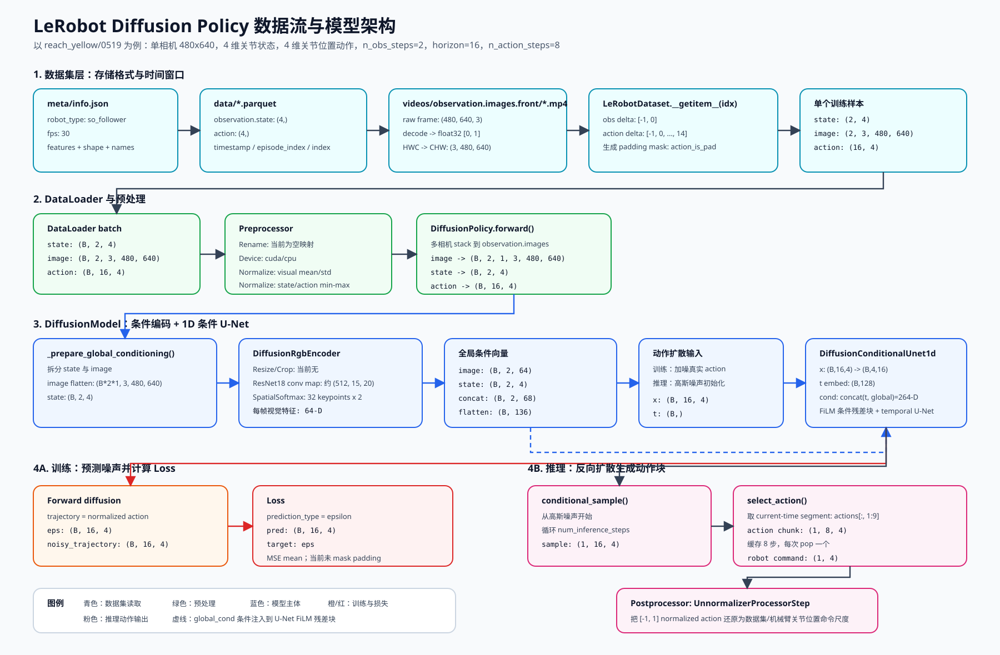

# Diffusion Policy

## 论文

<https://diffusion-policy.cs.columbia.edu>

## 数据流与模型架构图

下面这张图概括了 `reach_yellow/0519` 数据从 `LeRobotDataset` 读入、经过预处理、进入 `DiffusionModel`、训练计算 loss，以及推理输出机械臂动作的完整路径。



## 从 LeRobot 数据集到 DiffusionPolicy 动作输出

本文档总结当前 LeRobot `diffusion` 策略如何消费一个数据集样本、图像/状态/动作分别是什么 shape、经过哪些处理、如何进入 `DiffusionModel`、训练 loss 如何计算，以及推理时如何输出最终给机械臂执行的动作。

## 当前 `reach_yellow/0519` 训练的具体输入输出尺寸

本地缓存的 `reach_yellow/0519` 数据集元信息显示：

| 内容 | 数据集 key | 原始数据集元信息 shape | 进入 batch 前的运行时 tensor shape | 含义 |
| --- | --- | ---: | ---: | --- |
| 机器人状态 | `observation.state` | `(4,)` | `(4,)` | `shoulder_pan.pos`、`shoulder_lift.pos`、`elbow_flex.pos`、`wrist_flex.pos` |
| 动作 | `action` | `(4,)` | `(4,)` | 同样是 4 个关节位置命令维度 |
| 前置相机 | `observation.images.front` | `(480, 640, 3)` | `(3, 480, 640)` | RGB 图像，数据集中以视频帧存储，加载后转成 channel-first tensor |

当前保存下来的 diffusion 训练配置为：

| 配置项 | 值 | 作用 |
| --- | ---: | --- |
| `fps` | `30` | 每 `1 / 30` 秒一帧 |
| `n_obs_steps` | `2` | 模型用当前帧和前一帧作为条件 |
| `horizon` | `16` | diffusion U-Net 去噪一个 16 步动作轨迹 |
| `n_action_steps` | `8` | 推理时从生成的 16 步轨迹中取 8 步缓存/执行 |
| `drop_n_last_frames` | `7` | 训练采样时避开 episode 末尾，减少未来动作窗口被 padding 的情况 |
| `resize_shape` | `None` | 进 ResNet 前不显式 resize |
| `crop_shape` | `None` | 进 ResNet 前不显式 crop |
| `vision_backbone` | `resnet18` | 图像进入 ResNet-18，取最终卷积 feature map |
| `spatial_softmax_num_keypoints` | `32` | 每个相机视角编码成 64 维视觉特征 |
| `normalization_mapping` | visual `MEAN_STD`，state/action `MIN_MAX` | 图像做均值方差归一化；状态/动作缩放到 `[-1, 1]` |

所以，这次训练中：原始图像分辨率是 `480 x 640`，模型实际收到的也是 `480 x 640`，因为策略配置里没有 resize/crop。图像进入模型前主要发生的 shape 变化是 `HWC -> CHW`，再额外增加时间、batch、camera 维度。

## 数据集文件结构与各字段含义

`LeRobotDataset` 是当前离线训练用的主 dataset 类。一个 LeRobot 数据集目录通常包含：

- `meta/info.json`：feature schema、`fps`、robot type、总帧数/episode 数、数据和视频路径模板。
- `meta/stats.json`：归一化用的 min/max/mean/std 统计量。
- `meta/tasks.parquet`：任务文本。
- `meta/episodes/...parquet`：每个 episode 的边界、视频偏移等信息。
- `data/...parquet`：非视频逐帧数据，例如 `observation.state`、`action`、`timestamp`、`episode_index`、`frame_index`、`task_index`。
- `videos/<video_key>/...mp4`：相机视频流，例如 `videos/observation.images.front/...mp4`。

对于 `reach_yellow/0519`，`robot_type` 是 `so_follower`。状态向量和动作向量都包含 4 个关节位置维度：

1. `shoulder_pan.pos`
1. `shoulder_lift.pos`
1. `elbow_flex.pos`
1. `wrist_flex.pos`

这个数据集元信息里没有单独的 gripper action；模型学习的是一个 4 维关节位置命令向量。

## Policy feature 推断

训练时，`make_policy()` 会接收 `LeRobotDatasetMetadata`，然后通过 `dataset_to_policy_features()` 把数据集 feature 转成策略需要的 `PolicyFeature`：

1. 数据集中 `dtype` 为 `image` 或 `video` 的 feature 会被标记成 `FeatureType.VISUAL`。
1. 数据集图像 shape 以 `(H, W, C)` 存储，但 policy image shape 会转换成 `(C, H, W)`。
1. `observation.state` 被标记成 `FeatureType.STATE`。
1. `action` 被标记成 `FeatureType.ACTION`。

对当前数据集，最终得到：

```text
input_features = {
  "observation.state": PolicyFeature(type=STATE, shape=(4,)),
  "observation.images.front": PolicyFeature(type=VISUAL, shape=(3, 480, 640)),
}

output_features = {
  "action": PolicyFeature(type=ACTION, shape=(4,)),
}
```

## 时间窗口构造：为什么一个样本不是一帧

`DiffusionConfig` 定义了围绕当前数据集 index 采样哪些观测帧和动作帧：

```text
observation_delta_indices = range(1 - n_obs_steps, 1)
                          = [-1, 0]

action_delta_indices      = range(1 - n_obs_steps, 1 - n_obs_steps + horizon)
                          = [-1, 0, 1, ..., 14]
```

`make_dataset()` 会把这些整数 offset 除以数据集 `fps`，变成秒级 `delta_timestamps`。当 `fps = 30` 时：

```text
observation timestamps = [-1 / 30, 0]
action timestamps      = [-1 / 30, 0, 1 / 30, ..., 14 / 30]
```

因此，以当前时刻 `t` 为中心，一个训练样本会返回：

- 2 个观测：`t - 1`、`t`
- 16 个动作 target：`t - 1`、`t`、...、`t + 14`
- padding mask，例如 `action_is_pad`，用于标记请求的时间点是否越过当前 episode 边界

对于 `reach_yellow/0519`，一个未 batch 的训练 item 在 `LeRobotDataset.__getitem__()` 之后的关键 shape 是：

```text
observation.state        (2, 4)
observation.images.front (2, 3, 480, 640)
action                   (16, 4)
action_is_pad            (16,)
```

经过 `DataLoader(batch_size=B)` 后变成：

```text
observation.state        (B, 2, 4)
observation.images.front (B, 2, 3, 480, 640)
action                   (B, 16, 4)
action_is_pad            (B, 16)
```

## `LeRobotDataset.__getitem__()` 如何加载一个样本

对于 index `idx`，`LeRobotDataset.__getitem__()` 的核心流程是：

1. 从 `hf_dataset[idx]` 读取基础行；这行包含 parquet 里的标量元数据和非视频 tensor。
1. 读取 `episode_index` 和全局绝对 `index`。
1. 如果配置了 `delta_indices`，则为每个 key 构造时间窗口对应的 query indices。
1. 把 query indices clamp 到当前 episode 范围内，并生成类似 `action_is_pad` 的 bool padding mask。
1. 对非视频 key，从 parquet 里查询多个 index，并按时间维 stack。
1. 对视频 key，把请求的帧 index/timestamp 转换成 episode 视频文件内的 timestamp。
1. 调用 `decode_video_frames()` 从 mp4 中取出最接近目标时间戳的帧。
1. 视频/图像像素转成 `torch.float32`、范围 `[0, 1]`、channel-first 格式 `(C, H, W)`。
1. 如果 `dataset.image_transforms.enable=True`，会应用数据集级图像增强；当前保存配置为 `False`，所以没有颜色/仿射增强。
1. 根据 `task_index` 添加任务字符串 `task`。

注意：虽然图像在磁盘上是 mp4，但训练时不是把整个 mp4 直接扔给模型。dataset 会按时间窗口精确 seek/decode 所需帧，并与 state/action 时间戳对齐。

## 进入 policy 前的预处理

Diffusion 使用 `make_diffusion_pre_post_processors()` 构造 preprocessor/postprocessor。

输入 preprocessor 包含：

1. `RenameObservationsProcessorStep(rename_map={})`：当前配置中是空映射，相当于 no-op。
1. `AddBatchDimensionProcessorStep()`：单环境推理时补 batch 维；离线训练时 `DataLoader` 已经提供 batch。
1. `DeviceProcessorStep(device=config.device)`：把 tensor 移到 `cuda` 或 `cpu`。
1. `NormalizerProcessorStep(...)`：根据数据集统计量归一化。

当前配置的归一化规则：

| Feature type | 模式 | 作用 |
| --- | --- | --- |
| `VISUAL` | `MEAN_STD` | `(image - mean) / (std + eps)`；如果 `dataset.use_imagenet_stats=True`，相机统计量会被替换成 ImageNet mean/std |
| `STATE` | `MIN_MAX` | 每个关节状态维度按数据集 min/max 映射到 `[-1, 1]` |
| `ACTION` | `MIN_MAX` | 每个动作维度按数据集 min/max 映射到 `[-1, 1]` |

因此，policy 内部训练和采样都发生在归一化坐标系。推理输出后，postprocessor 会把预测动作反归一化回真实机械臂关节命令尺度。

## 训练时进入 `DiffusionPolicy.forward()`

训练循环核心调用是：

```text
batch = next(dataloader)
batch = preprocessor(batch)
loss, output_dict = policy.forward(batch)
```

在 `DiffusionPolicy.forward()` 内部：

1. 如果存在图像 feature，会收集配置中的每个相机 key。
1. 当前只有一个相机，`observation.images.front` 的 shape 是 `(B, 2, 3, 480, 640)`。
1. 它会被 stack 到内部统一 key `observation.images`。
1. 得到内部图像 tensor：

```text
observation.images (B, n_obs_steps, num_cameras, C, H, W)
                   (B, 2, 1, 3, 480, 640)
```

之后 batch 进入 `DiffusionModel.compute_loss()`。

## `DiffusionModel` 内部的图像编码路径

`DiffusionModel.__init__()` 会构造一个给 U-Net 使用的全局条件向量。当前配置下：

```text
state_dim = 4
num_cameras = 1
visual_feature_dim_per_camera = spatial_softmax_num_keypoints * 2 = 32 * 2 = 64
per_observation_condition_dim = 4 + 64 = 68
global_cond_dim_after_time_flatten = 68 * n_obs_steps = 68 * 2 = 136
```

图像编码器是 `DiffusionRgbEncoder`：

1. 输入到 encoder 的图像 tensor 是 `(B * n_obs_steps * num_cameras, 3, 480, 640)`。
1. resize：跳过，因为 `resize_shape=None`。
1. crop：跳过，因为 `crop_shape=None`。
1. 进入去掉最终 average-pool 和 classifier 的 ResNet-18 backbone。
1. 对 `480 x 640` 输入，ResNet-18 最终卷积 feature map 大约是 `(512, 15, 20)`，因为 backbone 总下采样约 `32x`。
1. `SpatialSoftmax` 把 feature map 映射成 `32` 个可学习 keypoint，每个 keypoint 是 `(x, y)`，所以是 `(32, 2)`。
1. flatten 后得到 `64` 维。
1. 再经过一个线性层和 ReLU，保持视觉特征为 `64` 维。

然后 `_prepare_global_conditioning()` 把图像特征 reshape 回时间/相机结构，并与状态拼接：

```text
image features before reshape: (B * 2 * 1, 64)
image features after reshape:  (B, 2, 64)
state features:               (B, 2, 4)
concat per time step:          (B, 2, 68)
flatten time:                  (B, 136)
```

这个 `(B, 136)` tensor 就是 `global_cond`，它会作为条件输入到 diffusion U-Net 的每个 FiLM 条件残差块中。

## 训练时动作轨迹和 U-Net shape

`DiffusionModel.compute_loss()` 期望 batch 中至少有：

```text
observation.state  (B, 2, 4)
observation.images (B, 2, 1, 3, 480, 640)
action             (B, 16, 4)
action_is_pad      (B, 16)
```

训练 target 是已经归一化后的动作 chunk：

```text
trajectory = batch["action"]  # (B, horizon, action_dim) = (B, 16, 4)
```

训练时先做 forward diffusion：

1. 采样高斯噪声 `eps`，shape 为 `(B, 16, 4)`。
1. 给 batch 中每个样本随机采一个 diffusion timestep，`timesteps` shape 为 `(B,)`。
1. 调用 `noise_scheduler.add_noise(trajectory, eps, timesteps)` 得到 `noisy_trajectory`，shape 为 `(B, 16, 4)`。
1. U-Net 根据 `noisy_trajectory`、`timesteps` 和 `global_cond` 预测噪声或干净动作样本。

当前配置 `prediction_type="epsilon"`，所以 U-Net 的目标是预测噪声 `eps`。

`DiffusionConditionalUnet1d.forward()` 接收：

```text
x           (B, 16, 4)      # 加噪动作轨迹
timestep    (B,)            # diffusion timestep
global_cond (B, 136)        # 图像+状态编码后的条件向量
```

U-Net 内部：

1. `x` 先 rearrange 成 `(B, 4, 16)`，因为 `Conv1d` 需要 channel 在前。
1. diffusion timestep 编码成 `(B, 128)`。
1. timestep embedding 与 global condition 拼接：

```text
conditioning vector = (B, 128 + 136) = (B, 264)
```

1. 这个 conditioning vector 进入各个 FiLM 条件残差块。
1. temporal U-Net 沿 `horizon` 维做下采样和上采样。
1. 最终输出 rearrange 回 `(B, 16, 4)`。

## Loss 计算

`DiffusionModel.compute_loss()` 中的损失是 MSE：

```text
if prediction_type == "epsilon":
    target = eps
elif prediction_type == "sample":
    target = clean action trajectory

loss = mse(pred, target, reduction="none")
```

如果 `do_mask_loss_for_padding=True`，则会用 `~batch["action_is_pad"]` 屏蔽 padded 动作 target。当前保存配置为 `False`，所以最终 loss 直接是：

```text
loss.mean()
```

训练循环随后执行 accelerator backward、梯度裁剪、optimizer step、zero grad、LR scheduler step。

## 推理路径：从观测到机械臂动作

部署或 eval 时，`DiffusionPolicy.select_action()` 每次只返回一个动作，但内部会一次生成一个动作块。

完整路径如下：

1. 机器人/环境提供最新单步观测：

```text
observation.state        (4,)
observation.images.front (3, 480, 640)  # 图像已转换成 tensor 后
```

1. diffusion preprocessor 补 batch 维、移到设备、归一化：

```text
observation.state        (1, 4)
observation.images.front (1, 3, 480, 640)
```

1. `select_action()` 把相机图像 stack 到内部 `observation.images`：

```text
observation.images (1, 1, 3, 480, 640)  # B, num_cameras, C, H, W，当前单时间步
```

1. `populate_queues()` 维护观测历史。`reset()` 后第一次调用时，会复制当前观测直到队列长度达到 `n_obs_steps=2`；之后每步 append 最新观测并丢掉最旧观测。
1. 当内部 action 队列为空时，`predict_action_chunk()` 会把观测队列沿时间维 stack：

```text
observation.state  (1, 2, 4)
observation.images (1, 2, 1, 3, 480, 640)
```

1. `DiffusionModel.generate_actions()` 像训练一样计算 `global_cond`。
1. `conditional_sample()` 从高斯噪声开始：

```text
sample (1, 16, 4)
```

1. 每个 reverse diffusion timestep 中，U-Net 预测去噪输出，scheduler 更新 sample。
1. 所有 reverse diffusion step 完成后，得到归一化动作轨迹 `(1, 16, 4)`。
1. policy 只取从当前观测时刻开始的一段：

```text
start = n_obs_steps - 1 = 1
end = start + n_action_steps = 9
actions = actions[:, 1:9]  # (1, 8, 4)
```

1. 这 8 个动作被缓存到内部队列。`select_action()` 每个控制周期 pop 一个动作：

```text
returned normalized action (1, 4)
```

1. diffusion postprocessor 使用 `UnnormalizerProcessorStep`，把 `[-1, 1]` 中的 normalized action 映射回数据集 action 的真实尺度。
1. 最终 4 维关节位置命令被发送给机械臂/action interface。

## 当前模型的主要 tensor shape 汇总

设 `B = batch_size`、`S = n_obs_steps = 2`、`N = num_cameras = 1`、`A = action_dim = 4`、`H = horizon = 16`：

| 阶段 | Tensor | Shape |
| --- | --- | --- |
| 原始元信息图像 shape | front camera | `(480, 640, 3)` |
| 解码后的图像 tensor | `observation.images.front` | `(3, 480, 640)` |
| 单样本图像时间窗口 | `observation.images.front` | `(2, 3, 480, 640)` |
| DataLoader 图像 batch | `observation.images.front` | `(B, 2, 3, 480, 640)` |
| policy 内部图像 batch | `observation.images` | `(B, 2, 1, 3, 480, 640)` |
| 单样本状态时间窗口 | `observation.state` | `(2, 4)` |
| 单样本动作时间窗口 | `action` | `(16, 4)` |
| DataLoader 状态 batch | `observation.state` | `(B, 2, 4)` |
| DataLoader 动作 batch | `action` | `(B, 16, 4)` |
| 图像编码器输入 | flattened images | `(B * 2 * 1, 3, 480, 640)` |
| 每帧图像特征 | encoded camera | `(B, 2, 64)` |
| 每帧 state+image | condition before flatten | `(B, 2, 68)` |
| 全局条件 | `global_cond` | `(B, 136)` |
| U-Net 输入轨迹 | noisy action | `(B, 16, 4)` |
| U-Net 内部 conv layout | noisy action | `(B, 4, 16)` |
| U-Net 输出 | predicted noise/sample | `(B, 16, 4)` |
| 推理生成动作块 | selected actions | `(B, 8, 4)` |
| 单次返回机械臂命令 | action | `(B, 4)` |

## 关键实现文件

- 数据集和元信息加载：`src/lerobot/datasets/lerobot_dataset.py`
- 数据集 feature 转 policy feature：`src/lerobot/datasets/utils.py`
- dataset 构造与时间窗口：`src/lerobot/datasets/factory.py`
- diffusion 配置：`src/lerobot/policies/diffusion/configuration_diffusion.py`
- diffusion pre/post processor：`src/lerobot/policies/diffusion/processor_diffusion.py`
- diffusion model、图像编码器、U-Net、loss、推理 chunk：`src/lerobot/policies/diffusion/modeling_diffusion.py`
- 训练循环：`src/lerobot/scripts/lerobot_train.py`

## 引用

```bibtex
@article{chi2024diffusionpolicy,
    author = {Cheng Chi and Zhenjia Xu and Siyuan Feng and Eric Cousineau and Yilun Du and Benjamin Burchfiel and Russ Tedrake and Shuran Song},
    title ={Diffusion Policy: Visuomotor Policy Learning via Action Diffusion},
    journal = {The International Journal of Robotics Research},
    year = {2024},
}
```
